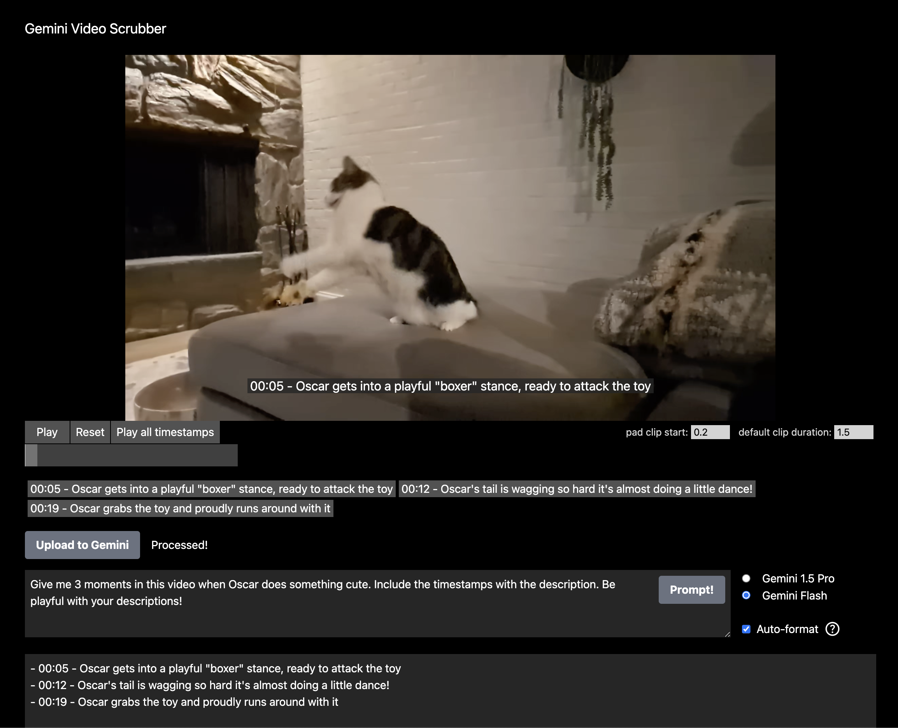

# Gemini Video Scrubber

GVS is a simple demo application showcasing the power of Gemini 1.5 Pro's video understanding abilities.



Specifically, it allows you to use Gemini to quickly analyze video content by prompting for associated timestamps, and making them clickable and playable as a stream. Additionally, any textual descriptions are added to the video element and played along their timestamps as well.

Just make sure to prompt Gemini with a time-specific request like:
```
Give me 3 cute moments in this video of my cat oscar, returning the timestamps and descriptions. Be playful with your descriptions
# check the "Auto-format" to append format-forcing language onto the prompt. 

// Model response:
00:11 Oscar leaps for the toy like a graceful gymnast.
00:16  Oscar's adorable struggle to catch the toy is too cute!
00:20 Oscar's triumphant pounce on the toy, like a champion.
```

Then click "Play all timestamps" to watch a playthrough of the relevant timestamps (+ their duration and 'captions') to see if it's what you were looking for!

This example is playful but we've used this technique internally to find clips from longer videos (up to 1hr!) that are interesting to share across teams. Gemini as your own research assistant!

## Run GVS (locally)

> Hate reading? [Click here for the 🎬Video Walkthrough🎬](https://www.youtube.com)

We suggest you stick to local usage/development, as large video uploads tend to complicate deployments.

Like any good prototype, getting started is simple:

### Obtain a Gemini API Key 
First, create a local `.env` file with your `GEMINI_API_KEY=` obtained from [aistudio.withgoogle.com](https://aistudio.google.com/app/apikey) or your [cloud console](https://ai.google.dev/gemini-api/docs/api-key):
```bash
$ echo "GEMINI_API_KEY='your_api_key'"" >> .env
```

 ### Install deps and run the project:

```bash
$ npm i
$ npm run dev
```

Once running at [localhost:3000](http://localhost:3000), the UI will ask for you to open up a video file. 

Once opened, you can do one of two things:
1. Paste a timestamp'ed response you might have gotten from another UI (like [AI Studio](https://aistudio.google.com))
2. Click the Upload To Gemini button to send that video file to the [Gemini File API](https://ai.google.dev/gemini-api/docs/prompting_with_media?lang=node), which handles breaking the video
into its individual frames (at 1fps) and audio stream, creating a short lived identifier, and begin the 
tokenization process.

We then simply poll the Files API until the video becomes `ACTIVE`, at which point we can use the video
identifier alongside any text prompt we want to [send to Gemini](https://ai.google.dev/gemini-api/docs/prompting_with_media?lang=node#generate-content-from-image). The File API handles caching the videos
tokens for 48hrs, so any prompts sent from here on out won't need to re-upload or tokenize the video (as long as you continue to use the correct ID in your calls.)

### Additional info

The UI can handle both single (##:##) and ranged (##:##-##:##) timestamps, with singular being padded by the "Default clip duration" option under the video. "Pad clip start" refers to extra time at the start of a timestamp, which we found helpful when doing single-word "supercut"-esque tests. ("ai ai ai ai ai ai")


See [src/Gemini.tsx]() for the UI implementation and handling of timecodes in responses, and [server/gemini.js]() for the API calls we make. The server component is necessary as the File API uses node `fs` commands that are unavailable on the client. More *adventurous* devs could by pass this by wrapping the [media.upload](https://ai.google.dev/api/rest/v1beta/media/upload) call itself :)

Made in collab with the legendary [GrantCuster](https://github.com/GrantCuster), who won the React vs Svelte battle *this time* 😀
